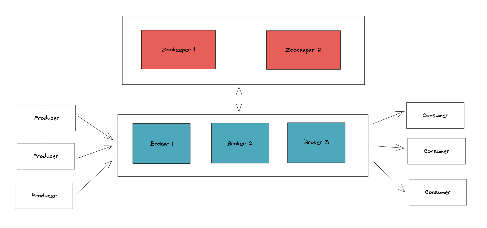

# Spark and Kafka in Docker

## Spark
**Spark version: **
Spark 3.3.0 for Hadoop 3.3 with OpenJDK 8 and Scala 2.12

### Spark Standalone mode

#### Spark master
To run Spark master
```bash
docker-compose up -d spark-master
```

#### Spark worker
To run Spark worker (1 or 2)
```bash
docker-compose up -d spark-worker-1
```

#### Run full Spark in your local
```bash 
docker-compose up -d
```

## Kafka

To start **Kafka**
```bash
docker-compose -f docker-compose-kafka.yml -d
```