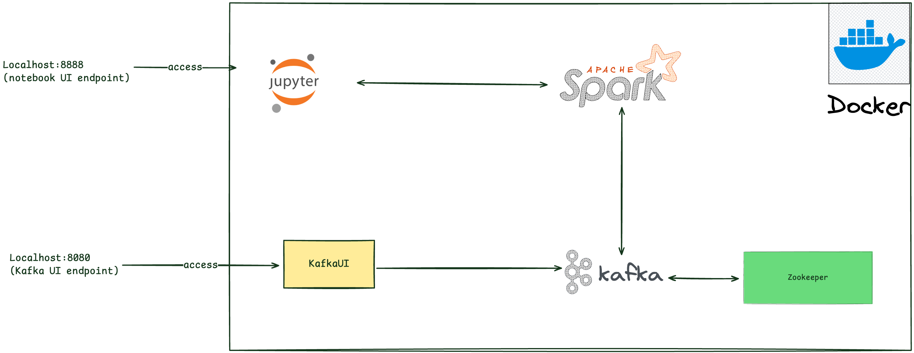
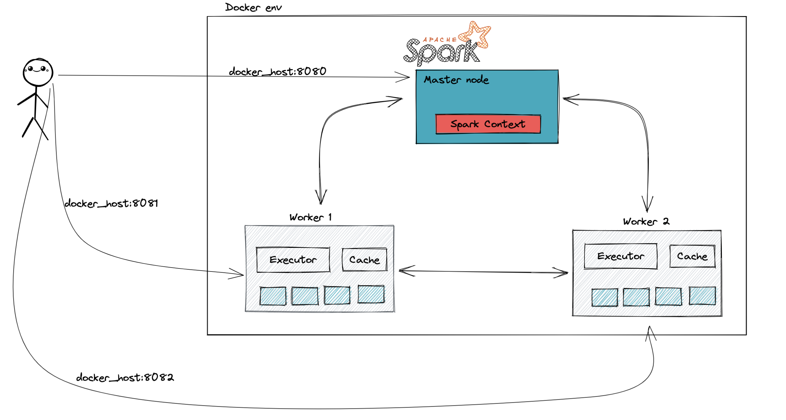
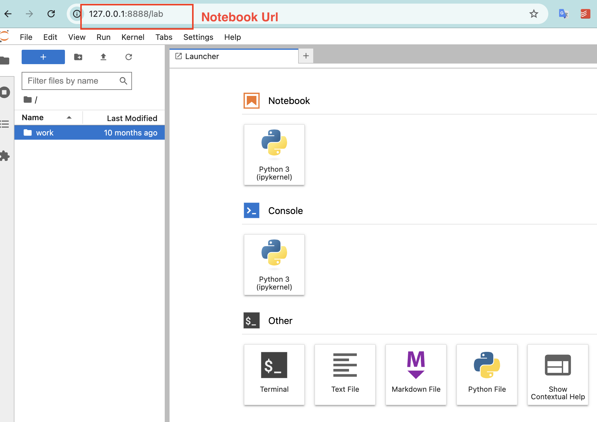
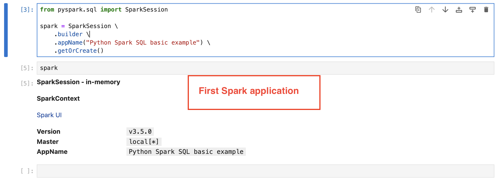
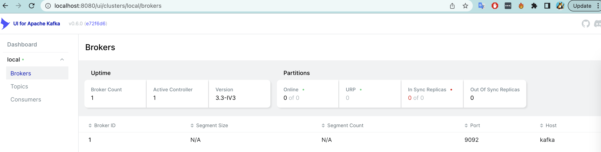
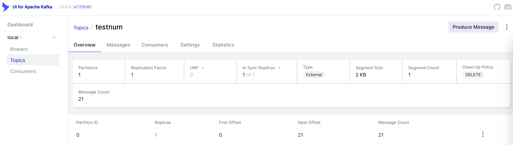
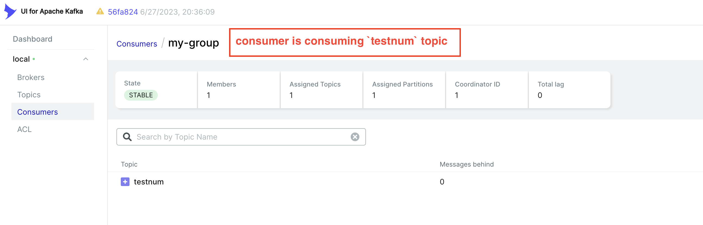

# Infrastructure
<!-- - [Infrastructure](#infrastructure) -->
- [Infrastructure](#infrastructure)
- [Spark and Kafka in Docker template for testing and learning](#spark-and-kafka-in-docker-template-for-testing-and-learning)
  - [Spark](#spark)
    - [Spark Standalone mode](#spark-standalone-mode)
      - [Spark Jupyter notebook](#spark-jupyter-notebook)
  - [Kafka](#kafka)
    - [\[Development\] Kakfa Standalone mode with 1 Zookeeper, 1 Kafka and Kafka UI](#development-kakfa-standalone-mode-with-1-zookeeper-1-kafka-and-kafka-ui)
  - [Tabular format](#tabular-format)
    - [Apache Iceberg](#apache-iceberg)
    - [Apache Hudi](#apache-hudi)
    - [Delta Lake](#delta-lake)

# Spark and Kafka in Docker template for testing and learning
## Spark
**Spark version:**
Spark latest version for Hadoop with OpenJDK 8 and Scala 2.12

### Spark Standalone mode


#### Spark Jupyter notebook
```bash
docker-compose -f infrastructure/standalone/docker-compose-spark.yml up -d
```




## Kafka
### [Development] Kakfa Standalone mode with 1 Zookeeper, 1 Kafka and Kafka UI
*How to run it*
```bash
docker-compose -f infrastructure/standalone/docker-compose-kafka.yml up -d
```

*How to see the Kafka via UI*
Go to [localhost:8080](localhost:8080) to view the Kafka UI


*View the Offset*


*View the Comsumer*


## Tabular format

### Apache Iceberg

### Apache Hudi

### Delta Lake